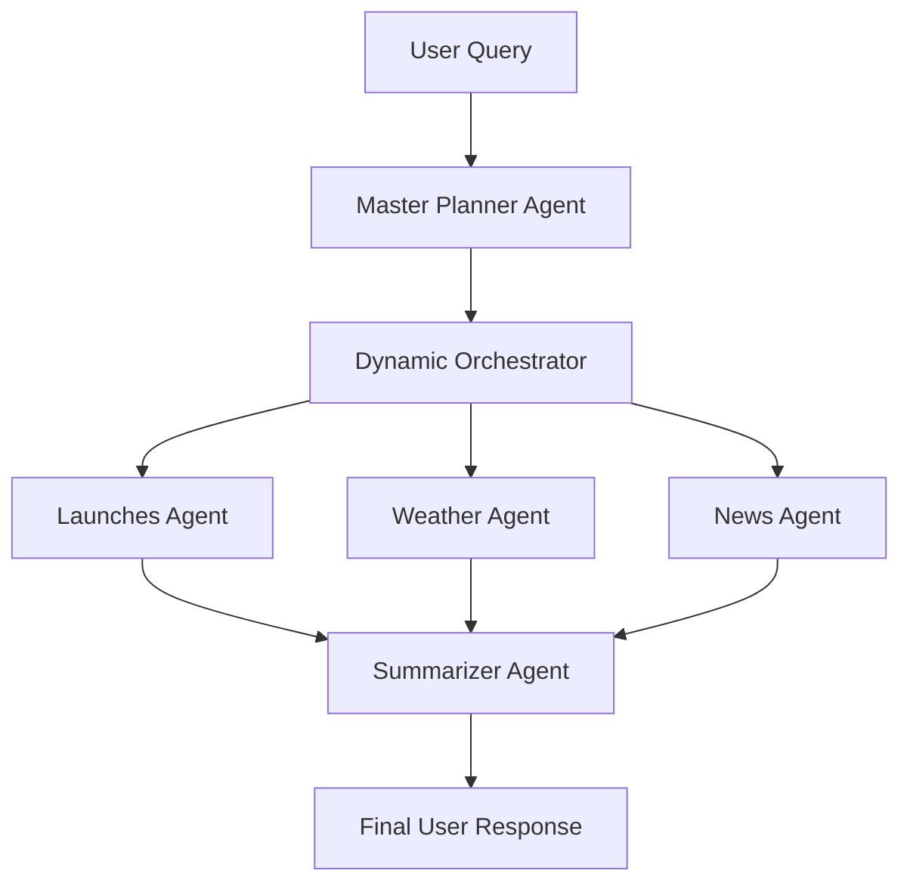

# 🚀 Multi-Agent System: Rocket Launches, Weather, and News Orchestration (Google ADK)

<p align="center">
  
</p>

<!-- Badges -->
<p align="center">
  <a href="https://github.com/GothiProCoder/AI-Powered-Ecommerce-Product-Listing-Generator/stargazers">
    
  </a>
  <a href="https://github.com/GothiProCoder/AI-Powered-Ecommerce-Product-Listing-Generator/issues">
  
</a>
  <a href="https://github.com/GothiProCoder/AI-Powered-Ecommerce-Product-Listing-Generator/blob/main/LICENSE">
    
  </a>
</p>

<hr>

##  Overview

Welcome to the **Multi-Agent System** powered by Google ADK!  
This project is an intelligent orchestration platform that brings together multiple specialized AI agents to answer complex queries about rocket launches, weather forecasts, and related news—all in one seamless conversation.

Whether you’re a space enthusiast, a weather watcher, or just curious about the latest news, this system provides accurate, up-to-date, and summarized information in a single response.

---

## ✨ Features

- **Rocket Launches**: Get details about upcoming, past, or specific rocket launches from agencies like SpaceX, NASA, ISRO, and more.
- **Weather Forecasts**: Instantly fetch weather information for any location and date, including launch sites.
- **News Aggregation**: Retrieve the latest news articles related to space, launches, or any custom topic.
- **Intelligent Summarization**: All results are synthesized into a concise, user-friendly summary—no technical jargon!
- **Dynamic Orchestration**: The system automatically plans and executes the right sequence of agents based on your query.
- **Modular & Extensible**: Easily add new agents or data sources as your needs grow.

---

## 🧠 How It Works

1. **User Query**: You ask a question (e.g., “What’s the next SpaceX launch and the weather for it?”).
2. **Master Planner Agent**: Analyzes your query and creates a step-by-step plan (e.g., [launches_agent, weather_agent, summarizer_agent]).
3. **Dynamic Orchestrator**: Runs each specialized agent in sequence, passing information along the chain.
4. **Sub-Agents**:
    - `launches_agent`: Fetches rocket launch data.
    - `weather_agent`: Gets weather forecasts.
    - `news_agent`: Finds relevant news articles.
    - `summarizer_agent`: Synthesizes all results into a clear, direct answer.
5. **Final Response**: You receive a single, easy-to-understand summary.

---

## 🏗️ System Architecture



---

## 🚦 Example Queries

- “When is the next NASA launch and what’s the weather at the launch site?”
- “Which was the first Spacex launch?”
- “What’s the weather in Paris tomorrow?”
- “Tell me about the latest SpaceX launch, weather, and related news.”

---

## 🛠️ Getting Started

### 1. Clone the Repository

```sh
git clone https://github.com/GothiProCoder/Multi-Agent-System-Google-ADK.git
```

**📝Important Note:** 
Make sure to always come out of the parent folder (i.e., multi-agent-system-google-adk) and navigate to one folder higher and then **Create The Virtual Environment** or **Install Required Libraries** or **Run The System**!

### 2. Set Up the Environment

- Ensure you have **Python 3.8+** installed.
- (Recommended) Create a virtual environment:
  ```sh
  python -m venv venv
  source venv/bin/activate  # On Windows: venv\Scripts\activate
  ```

### 3. Install Dependencies

```sh
pip install -r requirements.txt
```

### 4. Configure API Keys

Edit the `.env` file in the project root with the following:

```
GOOGLE_GENAI_USE_VERTEXAI = FALSE
GOOGLE_API_KEY = YOUR_GOOGLE_API_KEY
NEWS_API_KEY = YOUR_NEWS_API_KEY
```
**The API keys can be acquired at free of cost. 😉**
**GOOGLE_API_KEY**: [Click Here!](https://aistudio.google.com/apikey)
**NEWS_API_KEY**: [Click Here!](https://newsapi.org/register)

### 5. Run the System

```sh
adk web
```

---

## 🧩 Project Structure

```
Multi-Agent-System (Google ADK)/
│
├── agent.py                # Main orchestration script
├── sub_agents/
│   ├── launches_agent.py   # Rocket launches agent
│   ├── weather_agent.py    # Weather forecast agent
│   ├── news_agent.py       # News aggregation agent
│   └── summarizer_agent.py # Summarization agent
├── requirements.txt
├── README.md
└── .env
```

---

## 📝 Customization & Extensibility

- **Add New Agents**: Create a new agent in `sub_agents/` and register it in `agent.py`.
- **Change Data Sources**: Update the relevant agent’s tool function to use a different API.
- **Modify Summarization**: Tweak the summarizer agent’s instructions for different output styles.

---

## 🤝 Contributing

Contributions are welcome!  
Feel free to open issues, submit pull requests, or suggest new features.

---

## 📄 License

This project is licensed under the MIT License.

---

## 🙋 FAQ

**Q: Do I need coding experience to use this?**  
A: No! Just follow the setup instructions and ask your questions.

**Q: Can I add more data sources or agents?**  
A: Yes! The system is modular—just add your agent and plug it into the orchestrator.

**Q: What if I don’t have all the API keys?**  
A: The APIs used are all free so grab one from the respective website and you are good to go.

---

## 🌟 Acknowledgements

- [Google ADK](https://google.github.io/adk-docs/) for the agent development kit.
- [NewsAPI](https://newsapi.org/), [SpaceDev API](https://thespacedevs.com/), and [Open-Meteo](https://open-meteo.com/) for data sources.
---

> _Built with ❤️ by [GothiProCoder](https://github.com/GothiProCoder)_
